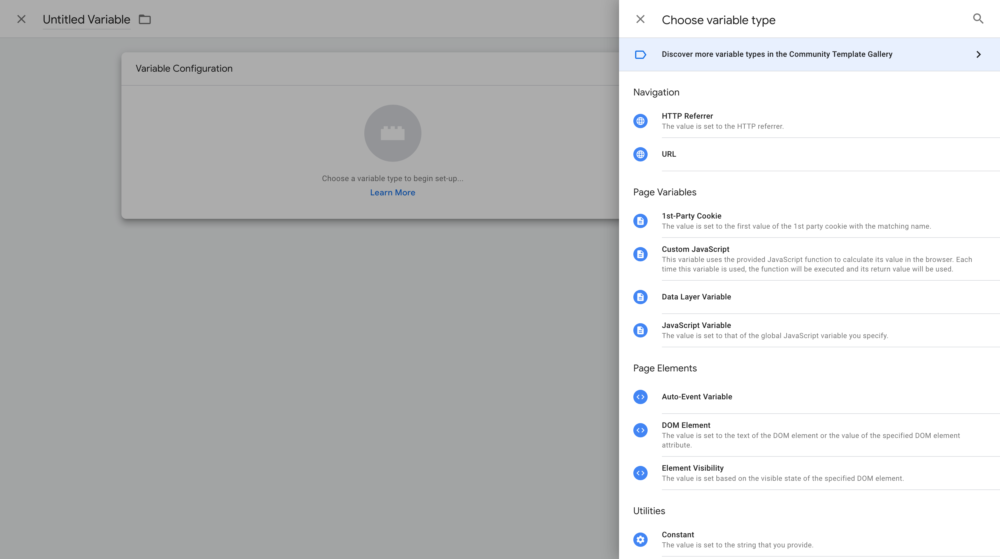
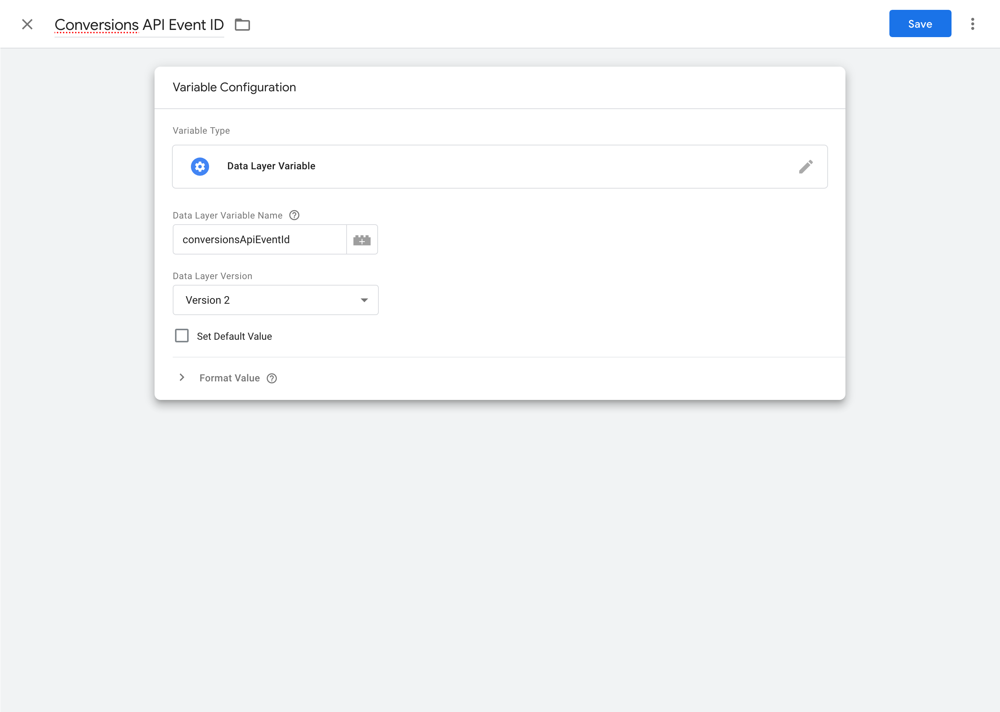
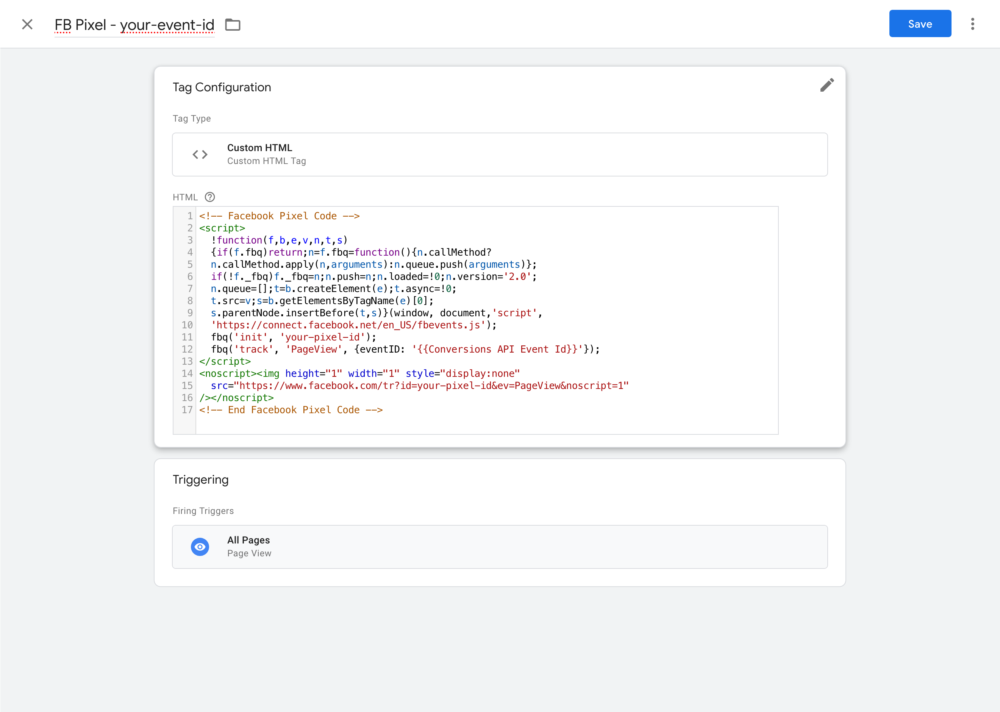

# Interact with the Facebook Conversions API

[](https://packagist.org/packages/esign/laravel-conversions-api)
[](https://packagist.org/packages/esign/laravel-conversions-api)


This package allow you to easily interact with the [Facebook Conversions API](https://developers.facebook.com/docs/marketing-api/conversions-api/).

## Installation

You can install the package via composer:

```bash
composer require esign/laravel-conversions-api
```

Next up, you can publish the configuration file:
```bash
php artisan vendor:publish --provider="Esign\ConversionsApi\ConversionsApiServiceProvider" --tag="config"
```

The config file will be published as config/conversions-api.php with the following content:
```php
return [
    /**
     * The access token used by the Conversions API.
     */
    'access_token' => env('CONVERSIONS_API_ACCESS_TOKEN'),

    /**
     * The pixel ID used by the Conversions API.
     */
    'pixel_id' => env('CONVERSIONS_API_PIXEL_ID'),

    /**
     * The Conversions API comes with a nice way to test your events.
     * You may use this config variable to set your test code.
     */
    'test_code' => null,
];
```

## Conversions API

### Events
To add events to the conversions API you may use the `addEvent` or `setEvents` methods.
Retrieving or clearing events may be done using the `getEvents` and `clearEvents` methods:
```php
use Esign\ConversionsApi\Facades\ConversionsApi;
use FacebookAds\Object\ServerSide\UserData;
use FacebookAds\Object\ServerSide\Event;

ConversionsApi::addEvent(
    (new Event())->setEventName('PageView')->setEventId('abc')
);

ConversionsApi::setEvents([
    (new Event())->setEventName('PageView')->setEventId('abc'),
    (new Event())->setEventName('Purchase')->setEventId('xyz'),
]);

ConversionsApi::getEvents();
ConversionsApi::clearEvents();
```

Adding events won't cause them to be sent to the Conversions API.
To actually send the events you must call the `sendEvents` method:
```php
use Esign\ConversionsApi\Facades\ConversionsApi;

ConversionsApi::sendEvents();
```

### User Data
This package also comes with a way to define default user data for the user of the current request.
You may do so by calling the `setUserData` method, this is typically done in your `AppServiceProvider`:
```php
use Esign\ConversionsApi\Facades\ConversionsApi;
use FacebookAds\Object\ServerSide\UserData;

ConversionsApi::setUserData(
    (new UserData())
        ->setEmail(auth()->user()?->email)
);
```

You may now pass the user data along with your events:
```php
use Esign\ConversionsApi\Facades\ConversionsApi;
use FacebookAds\Object\ServerSide\UserData;

ConversionsApi::addEvent(
    (new Event())->setUserData(ConversionsApi::getUserData())
);
```

## Event deduplication
This package comes with a few ways to assist you in [deduplicating browser and server events](https://developers.facebook.com/docs/marketing-api/conversions-api/deduplicate-pixel-and-server-events/). This can either be done using the Facebook Pixel directly or through Google Tag Manager's data layer.

### Facebook Pixel
Before attempting to send events through Facebook Pixel make sure to load the pixel script:
```blade
<x-conversions-api-facebook-pixel-script />
```

This will render the following html:
```html
<script>
    !function(f,b,e,v,n,t,s){if(f.fbq)return;n=f.fbq=function(){n.callMethod?
    n.callMethod.apply(n,arguments):n.queue.push(arguments)};if(!f._fbq)f._fbq=n;
    n.push=n;n.loaded=!0;n.version='2.0';n.queue=[];t=b.createElement(e);t.async=!0;
    t.src=v;s=b.getElementsByTagName(e)[0];s.parentNode.insertBefore(t,s)}(window,
    document,'script','https://connect.facebook.net/en_US/fbevents.js');

    fbq('init', 'your-configured-pixel-id', {});
</script>
```

This package will attempt to provide as much advanced matching data as possible by using user data from the `ConversionsApi`.
For example when an email address is set, it will automatically be provided to the init method:
```php
ConversionsApi::setUserData(
    (new UserData())->setEmail('john@example.com')
);
```
```js
fbq('init', 'your-configured-pixel-id', {"em": "john@example.com"});
```

Now that your Pixel is correctly initialized, it's time to send some events.    
Sadly the parameters between the Conversions API and Facebook Pixel are not identical, so they must be mapped to the [correct format](https://developers.facebook.com/docs/meta-pixel/reference).
An easy way of doing this is by extending the `FacebookAds\Object\ServerSide\Event` class and implementing the `Esign\ConversionsApi\Contracts\MapsToFacebookPixel` interface on it:
```php
use Esign\ConversionsApi\Contracts\MapsToFacebookPixel;
use Esign\ConversionsApi\Facades\ConversionsApi;
use FacebookAds\Object\ServerSide\ActionSource;
use FacebookAds\Object\ServerSide\Event;

class PurchaseEvent extends Event implements MapsToFacebookPixel
{
    public static function create(): static
    {
        return (new static())
            ->setActionSource(ActionSource::WEBSITE)
            ->setEventName('Purchase')
            ->setEventTime(time())
            ->setEventSourceUrl(request()->url())
            ->setEventId((string) Str::uuid())
            ->setUserData(ConversionsApi::getUserData());
    }

    public function getFacebookPixelEventType(): string
    {
        return 'track';
    }

    public function getFacebookPixelEventName(): string
    {
        return $this->getEventName();
    }

    public function getFacebookPixelCustomData(): array
    {
        $customData = $this->getCustomData();

        return array_filter([
            'currency' => $customData?->getCurrency(),
            'value' => $customData?->getValue(),
        ]);
    }

    public function getFacebookPixelEventData(): array
    {
        return array_filter(['eventID' => $this->getEventId()]);
    }
}
```

You may now pass any class that implements the `MapsToFacebookPixel` interface to the view component responsible for tracking Facebook Pixel events:
```php
use FacebookAds\Object\ServerSide\CustomData;
use Illuminate\Support\Str;

$event = PurchaseEvent::create()->setCustomData(
    (new CustomData())->setCurrency('EUR')->setValue(10)
);
```

```blade
<x-conversions-api-facebook-pixel-tracking-event :event="$event" />
```

This will render the following script tag:
```html
<script>
    fbq('track', 'Purchase', {"currency": "EUR", "value": 10}, {"eventID": "ccf928e1-56fd-4376-bee3-dda0d7dbe136"});
</script>
```

To retrieve a list of all events that implement the `MapsToFacebookPixel` interface you may call the `filterFacebookPixelEvents` method:
```blade
@foreach(ConversionsApi::getEvents()->filterFacebookPixelEvents() as $event)
    <x-conversions-api-facebook-pixel-tracking-event :event="$event" />
@endforeach
```

In case you want more control over what's being rendered, you may always use the anonymous component:
```blade
<x-conversions-api::facebook-pixel-tracking-event
    eventType="track"
    eventName="Purchase"
    :customData="[]"
    :eventData="[]"
/>
```

### Google Tag Manager
A convenient dataLayer helper is included in case you want to load the Facebook Pixel through Google Tag Manager.
By default a variable name `conversionsApiEventId` will be used:
```php
@conversionsApiDataLayer
@include('conversions-api::data-layer')
```

You may also pass a custom variable name:
```php
@conversionsApiDataLayer('yourDataLayerVariableName')
@include('conversions-api::data-layer', ['dataLayerVariableName' => 'yourDataLayerVariableName'])
```

#### Configuring Google Tag Manager
First off, you should add a new `Data Layer Variable` to your Google Tag Manager workspace.


Next up you should use the variable name that was passed along to the data layer view.


After saving the variable you should be able to use it in your Facebook Pixel script using the double bracket syntax: `{{ Name of your variable }}`.


## PageView Events
This package ships with some helpers to track `PageView` events out of the box.
These helpers will automatically send both Conversions API & Facebook Pixel events and provide event deduplication.
> **Note**
> Make sure to always include these view components after you've already looped over any other events currently defined on the ConversionsApi. Including these view components will clear any existing events.
In case you're using the Facebook Pixel directly:
```blade
<x-conversions-api-facebook-pixel-page-view />
```
Or by using Google Tag Manager. The data-layer variable to deduplicate events is called `conversionsApiPageViewEventId`.
```blade
<x-conversions-api-data-layer-page-view />
```

## Troubleshooting
### PageView events are not shown as deduplicated in the test events dashboard
Event deduplication for PageView events should be fine out of the box, since the event name and event id parameters have been provided.
However, when serving your application locally the ip address returned by Laravel's `request()->ip()` will be `127.0.0.1`.
This is different from the ip address sent through Facebook Pixel, causing the Conversions API and Facebook Pixel events to not be deduplicated.
This issue should solve itself once the application will be ran in production.


## Testing

```bash
composer test
```

## License

The MIT License (MIT). Please see [License File](LICENSE.md) for more information.
